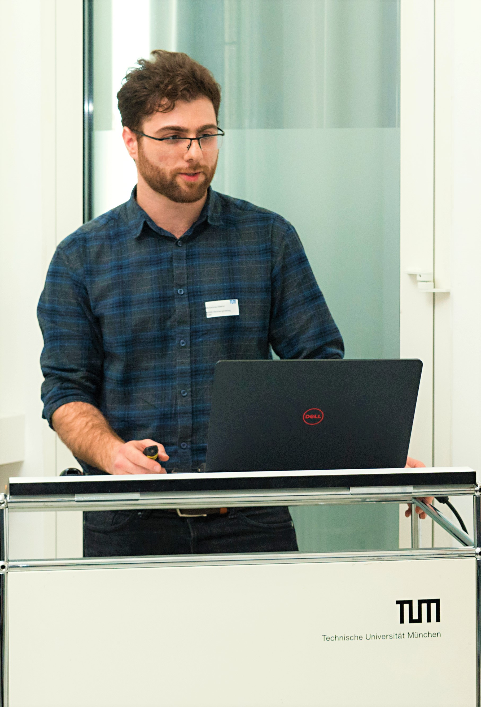

<!--[Profile Image]({{ site.url }}/{{ site.picture }})-->

<!---->

I am a neuroengineering graduate student at Technical University of Munich. I have done my bachelor in electrical and electronics engineering, in Malaysia. 

<h2>Skills</h2>

<ul class="skill-list">
	<li>HTML - Jade - Haml - Erb</li>
	<li>Responsive (Mobile First)</li>
</ul>

<h2>Projects</h2>

<ul>
	<li><a href="https://github.com/mohammadbashiri/BayesianMotorAdaptation">Bayesian Motor Adaptation</a></li>
	<li><a href="https://github.com/mohammadbashiri/vrlatency">VRLatency</a></li>
</ul>

<h2>Publications</h2>
	<li>EEG-based Brain Connectivity Analysis of Attention and Working Memory</li>
	<li>A Tractography Analysis for Electroconvulsive Therapy</li>
	<li>CSS (Stylus, Sass, Less)</li>

<h2>Hobbies</h2>
	<li>HTML - Jade - Haml - Erb</li>
	<li>Responsive (Mobile First)</li>
</ul>