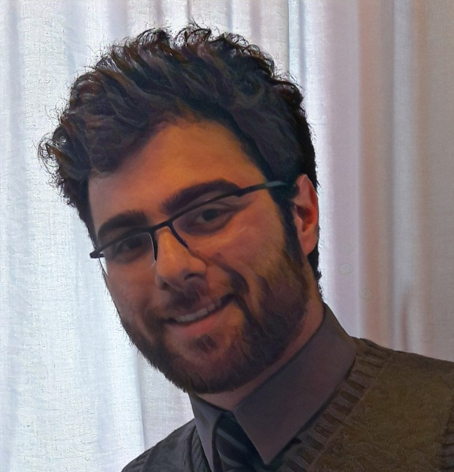

<!--[Profile Image]({{ site.url }}/{{ site.picture }})-->

	I am a neuroengineering graduate student at Technical University of Munich (TUM). My background is in electrical and electronics engineering. At the moment, I am in my 4th semester and exploring opportunities for master thesis. At the same time, I am working on development of a virtual reality (VR) system for freely moving rodents, in <a href="http://cogneuro.bio.lmu.de/" target="_blank">SirotaLab (Cognition and Neural Plasticity)</a> at Ludwig Maximillian University (LMU).

	My research interest lies in cognitive computational neuroscience, probabilistic modeling, Bayesian inference, and brain stimulation, as well as developing research tools for neuroscientists. 
	To know more about my activities please visit <a href="https://mohammadbashiri.github.io/blog/">blog</a> section. And to know more about my projects please visit <a href="https://mohammadbashiri.github.io/projects/">projects</a> section.

<h2>Skills</h2>

<ul class="skill-list">
	<li>Python</li>
	<li>Matlab</li>
	<li>C++</li>
	<li>Multisim</li>
	<li>TINA-TI</li>
	<li>Altium</li>
	<li>3D Slicer</li>
	<li>Materialize</li>
	<li>SolidWorks</li>
	<li>Autodesk Inventor</li>
	<li>Blender</li>
	<li>Comsol Multiphysics</li>
</ul>

<h2>Projects</h2>

<ul>
	<li><a href="https://github.com/mohammadbashiri/bayesian-motor-adaptation" target="_blank">Bayesian Motor Adaptation</a></li>
	<li><a href="https://github.com/mohammadbashiri/attention-eeg" target="_blank">Attention EEG</a></li>
	<li><a href="https://github.com/mohammadbashiri/vrlatency" target="_blank">VRLatency</a></li>
	<li><a href="https://github.com/mohammadbashiri/non-invasive-deep-brain-stimulation" target="_blank">Non-invasive Deep Brain Stimulation: Computational Modeling</a></li>
	<li><a href="https://github.com/mohammadbashiri/talktracker" target="_balnk">TalkTracker</a></li>
</ul>

<h2>Publications</h2>

<ul>
	<li> (2018) A Tractography Analysis for Electroconvulsive Therapy (accepted)</li>
	<li> (2015) EEG-based Brain Connectivity Analysis of Attention and Working Memory <a href="https://ieeexplore.ieee.org/document/7435890/" target="_blank">(link)</a>.</li>
</ul>

<!--
<h2>Hobbies</h2>

<ul>
	<li>Sports</li>
	<li>Organizaing (and participating) in casual scientific events</li>
	<li>Photography</li>
	<li>Dancing</li>
	<li>Travelling</li>
</ul>
-->

	For a more detailed description of my academic background and projects please check out my <a href="https://mohammadbashiri.github.io/assets/Bashiri-Resume.png" target="_blank">resume</a>.I am always happy to converse over new ideas, possibilities and project opportunities and potentially collaborations for common project, no matter where you reside in the world. Please do no hesistate to contact me using any of the communication channels available in the <a href="https://mohammadbashiri.github.io/">homepage</a>.

